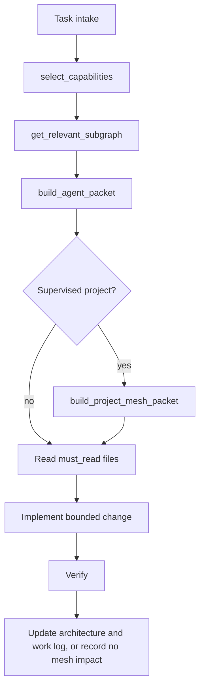

# Autopilot Quickstart

Use this flow for a bounded Autopilot-controlled work slice.



## Flow

1. Classify the task intake: scope, owner, affected project, risk, and whether the work touches auth, payments, persistence, uploads, public APIs, frontend UX, security, or release behavior.
2. Call `select_capabilities` for tasks that may touch web builds, optimization, data, SEO, automation, recovery, documents, bots/RAG, or 3D.
3. Call `get_relevant_subgraph` for compact routing context and stop conditions.
4. Call `build_agent_packet` for the active role.
5. If the task belongs to a supervised project, call `build_project_mesh_packet` for that project before reading product-specific files.
6. Read only the packet's `must_read` files plus direct local context needed for the change.
7. Stop for an owner decision if the mesh reports stop conditions, unless the task explicitly resolves that stop condition.
8. Implement only the locked scope.
9. Verify with the narrowest practical checks, then broader checks when the change affects shared behavior.
10. Update the relevant architecture record and work log after meaningful work, or record why there was no mesh impact.

## Boundary

Autopilot is the control plane for routing, governance, review, and evidence. It is not the product runtime.

The root `mesh/` describes Autopilot's own operational behavior only. Every supervised project needs its own project-specific Decision Mesh under:

```text
docs/projects/<slug>/decision-mesh/
```

If a supervised project does not have that mesh during architecture onboarding, creating it is a stop condition before implementation planning continues. Do not reuse Autopilot's operational mesh as a product mesh.
