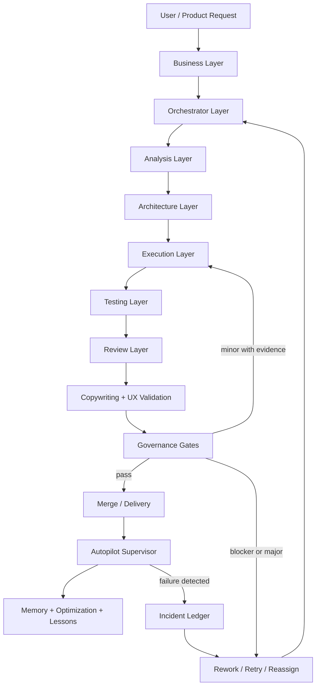
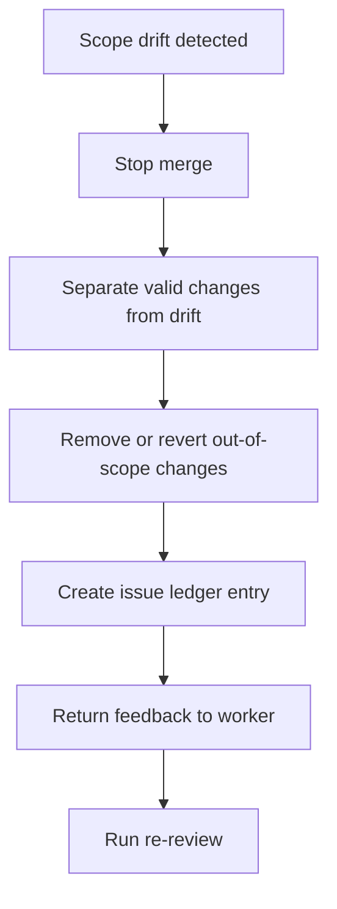
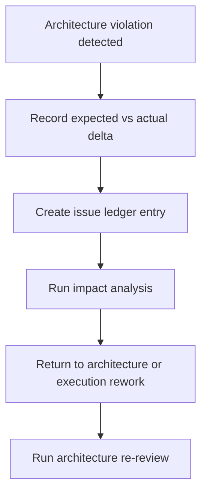
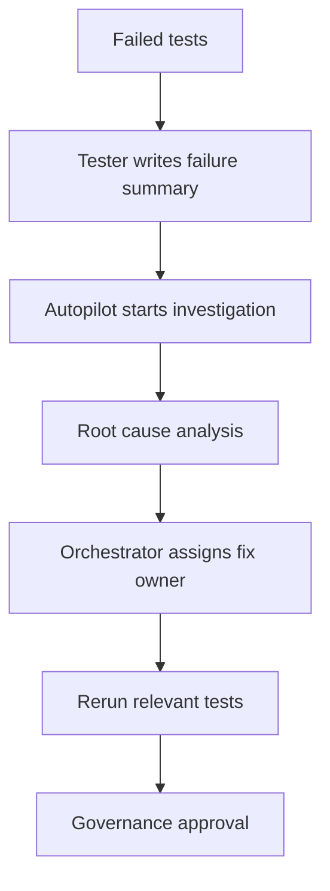

# Delivery System Governance

Date introduced: 2026-05-13
Status: phase-0 governance contract
Owner: Autopilot Control Plane

This document defines the workflow architecture, layer responsibilities, permissions, gates, rework flows, and supervisor boundaries for the Multi-Agent Autonomous Delivery System.

The delivery system is not an execution runtime yet. It is a governed workflow contract for how Autopilot receives, decomposes, validates, delivers, monitors, and learns from project work.

## Core Rule

Nobody approves their own work.

This rule applies to every layer, role, agent, worker, reviewer, tool, connector, and automation. A successful test run is evidence, not approval.

## Architecture Boundary

Autopilot is the control plane:

- owns governance rules, ledgers, project architecture registry, run logs, and workflow contracts
- creates or supervises separate product repositories
- monitors failures, stale reviews, incidents, and lessons
- proposes recovery actions

Autopilot does not:

- own product business scope
- approve delivery of its own outputs
- silently mutate product repositories
- treat connector output as source of truth without review
- run durable autonomous execution before an approved execution-engine decision record exists

Autopilot's root Decision Mesh is Autopilot's operational mesh. It describes Autopilot's internal routing, governance, review, and reasoning behavior.

Every supervised project must have its own project-specific Decision Mesh created during architecture onboarding if it does not already exist. Product/project meshes live with that project's architecture records and must be updated after every meaningful completed work slice.

Product projects live in their own repositories and roots:

```text
C:\Users\sirok\Documents\Projects\<project-slug>
SirRadek/<project-slug>
```

## Workflow Architecture



## Workflow States

| State | Owner | Required Input | Required Output | Allowed Next States |
| --- | --- | --- | --- | --- |
| `intake` | Business Layer | user request | scoped business outcome, assumptions | `analysis`, `rejected`, `needs_clarification` |
| `analysis` | Analysis Layer | scoped outcome | risks, dependencies, edge cases, unknowns | `architecture`, `needs_clarification`, `rejected` |
| `architecture` | Architecture Layer | analysis output | architecture impact and boundary decision | `planning`, `rework`, `rejected` |
| `planning` | Orchestrator Layer | architecture decision | dependency graph, task split, write scopes | `execution`, `needs_approval`, `rework` |
| `execution` | Execution Layer | approved bounded scope | implementation evidence and changed files | `testing`, `rework` |
| `testing` | Testing Layer | implementation evidence | test result and failure summary | `review`, `failed_tests` |
| `review` | Review Layer | implementation and tests | code/security/architecture/UX review | `governance`, `rework` |
| `copywriting_ux` | Copywriting Layer | user-facing change | wording, accessibility, localization review | `governance`, `rework` |
| `governance` | Governance Layer | reviews, tests, ledgers | gate result | `delivery`, `rework`, `escalated` |
| `delivery` | Delivery Owner | passing gate result | merge, release, or handoff evidence | `monitoring`, `closed` |
| `monitoring` | Autopilot Supervisor | delivered run | incident/staleness checks | `memory`, `incident` |
| `memory` | Memory Layer | run artifacts | decision, issue, lessons, and architecture updates | `closed` |
| `incident` | Autopilot Supervisor | failure or drift | issue ledger entry and recovery proposal | `rework`, `escalated` |

## Layer Responsibilities And Permissions

### Business Layer

Responsibilities:

- translate requests into product outcomes
- validate ROI, user value, and roadmap fit
- manage scope and acceptance criteria
- decide whether a request is worth pursuing

Must not:

- approve technical implementation
- bypass architecture review
- hide scope changes inside implementation tasks

### Orchestrator Layer

Responsibilities:

- decompose work into bounded tasks
- build dependency graph
- assign roles and write scopes
- coordinate retries, rework, and handoffs

Must not:

- approve its own plans or outputs
- change business scope without a logged decision
- merge results without testing, review, and governance evidence
- silently expand worker scope

### Architecture Layer

Responsibilities:

- own boundaries, modularity, dependencies, integration flow, security patterns, performance patterns, and maintainability
- require project architecture updates when changes affect runtime, data flow, deployment, privacy, or integrations

Must not:

- approve unreviewed implementation shortcuts
- accept silent architecture drift
- treat working code as sufficient evidence

### Analysis Layer

Responsibilities:

- produce risks, assumptions, dependencies, edge cases, unknowns, and recommendations
- identify unstable external facts that require current documentation checks

Must not:

- implement fixes
- approve scope changes
- skip unresolved unknowns when they affect safety or architecture

### Execution Layer

Responsibilities:

- implement only assigned bounded scope
- preserve unrelated user changes
- return changed files, tests, risks, and architecture impact

Must not:

- approve its own work
- change product scope
- make architectural changes without approval
- perform remote mutation unless explicitly approved and logged

### Testing Layer

Responsibilities:

- verify unit, integration, regression, E2E, acceptance, performance, and security-impact evidence as applicable
- produce failure summaries and reproduction steps

Must not:

- implement business logic as part of testing
- approve architecture
- change task scope

### Review Layer

Responsibilities:

- review code quality, security, architecture compliance, UX consistency, maintainability, scope, and regression risk
- order findings by severity and require rework where needed

Must not:

- approve work authored by the same role or agent
- ignore missing tests or ledger updates

### Copywriting And UX Layer

Responsibilities:

- validate UI text, localization, CTA clarity, tone, accessibility wording, and content consistency

Must not:

- change business scope
- approve technical delivery

### Governance Layer

Responsibilities:

- enforce architecture compliance, development plan alignment, best practices, acceptance criteria, testing status, security review, and scope validation
- produce structured gate results

Must not:

- approve incomplete evidence
- approve self-reviewed work
- skip issue or decision ledgers

### Autopilot Supervisor

Responsibilities:

- Autopilot monitors runs, timeouts, failed workflows, stale architecture reviews, incidents, and lessons
- trigger investigation and recovery proposals
- maintain run evidence and optimization notes

Must not:

- own product scope
- approve delivery
- bypass governance
- redesign product architecture on its own

### Memory Layer

Responsibilities:

- maintain project memory, decision memory, issue memory, architecture memory, workflow memory, and lessons memory
- keep large run artifacts outside the active context and summarize them into ledgers

Must not:

- overwrite historical decisions without a new decision entry
- treat compressed summaries as more authoritative than source artifacts

## Required Governance Gates

| Gate | Owner | Required Evidence | Failure Action |
| --- | --- | --- | --- |
| Business alignment | Business Layer | outcome, user value, scope | return to intake |
| Architecture compliance | Architecture Layer | architecture record and impact statement | rework |
| Development plan alignment | Orchestrator Layer | plan, dependency graph, write scope | rework |
| Best practices | Review Layer | code or artifact review | rework or inline fix |
| Acceptance criteria | Business + Testing | criteria checklist | rework |
| Testing status | Testing Layer | command output or explicit not-applicable reason | rework |
| Security review | Review Layer | findings or explicit no-actionable-findings result | rework or escalate |
| Scope validation | Governance Layer | changed files and scope comparison | split or revert out-of-scope work |
| Project mesh current | Architecture + Governance | project-specific mesh exists and update impact recorded | block delivery |
| Repository boundary | Governance Layer | canonical root and remote check | stop merge |
| Ledger completeness | Governance Layer | decision, issue, gate, and work-log evidence | block delivery |

## Decision Matrix

| Finding | Definition | Decision | Next Action |
| --- | --- | --- | --- |
| `blocker` | unsafe, failing critical acceptance, security/privacy risk, or broken architecture boundary | fail | stop merge, log issue, assign rework |
| `major_issue` | materially incomplete, high regression risk, missing required test or gate evidence | fail | rework and re-review |
| `minor_issue` | small in-scope defect that does not affect architecture, business logic, or safety | conditional | inline fix only with evidence and log entry |
| `cosmetic` | wording or presentation polish with no functional or governance impact | pass_with_notes | log note or schedule follow-up |
| `pass` | all required evidence present and no unresolved issues | pass | proceed to next state |

## Inline Fix Rules

Inline fixes are allowed only when all conditions are true:

- the fix is small and local
- the fix does not change architecture
- the fix does not change business scope
- the fix does not alter security, privacy, or persistence behavior
- the fix does not require redesign
- the fix is logged in the work log or issue ledger
- verification evidence is attached

If any condition fails, route to rework.

## Scope Drift Flow



## Architecture Violation Flow



## Failed Test Flow



## Gate Result Contract

```yaml
gate_result:
  status:
  checked_against:
  issues:
  decision_reason:
  next_action:
```

Allowed `status` values:

- `pass`
- `pass_with_notes`
- `conditional_inline_fix`
- `rework_required`
- `blocked`
- `escalated`

## Analysis Output Contract

```yaml
analysis:
  risks:
  assumptions:
  dependencies:
  edge_cases:
  unknowns:
  recommendations:
```

## Final Handoff Contract

Every workflow handoff must include:

- role
- mode
- project slug
- repository root
- remote repository
- requested scope
- files changed or inspected
- architecture impact
- project mesh impact
- ledger impact
- tests or verification
- unresolved risks
- next action

Missing handoff fields block delivery.
