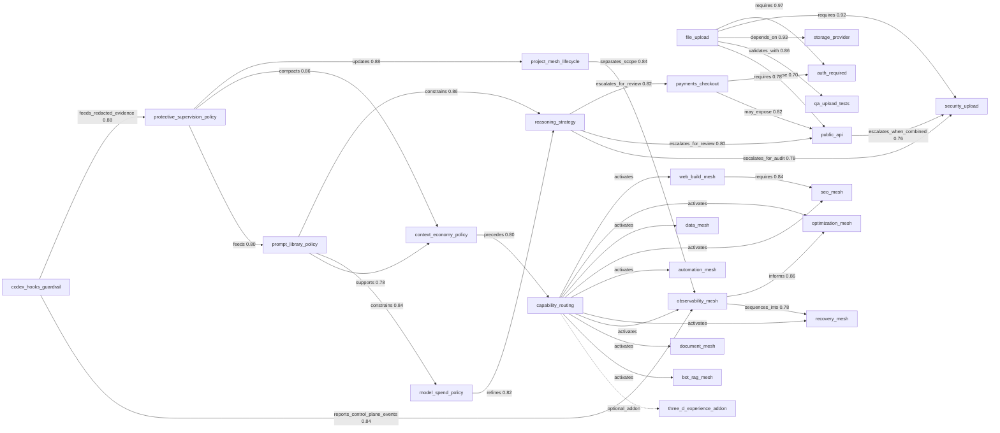

# Autopilot Mesh & Learning-Loop Map

Date: 2026-06-19
Reviewer: Claude (Opus 4.8) — architecture/governance review
Scope: Autopilot control-plane `v0.2.0` (commit `a545ed8`)
Status: review report — no runtime behavior changed by this document
Method: read-only static review of `mesh/`, `src/lib/decision-mesh/`,
`src/data/delivery-system/`, `scripts/`, `mcp/`, `prompt-library/`,
`product-design-os/`, `.codex/hooks/`, and `docs/`.

---

## Shrnutí pro ownera (CZ)

Autopilot je **kontextový router a governance vrstva**, ne běhové prostředí. Mesh,
prompt-library, ledgery i taste-paměť jsou dobře navržené a deterministické.

Tři odpovědi na zadání:

1. **Sbíráme dost informací pro učení a opravy?** Částečně. Existují **tři paměti**
   (taste / ledgery / hook-evidence), ale jsou **odpojené od rozhodování** a dvě ze
   tří jsou prakticky prázdné nebo prchavé. Záznam ano — zpětné použití ne.
2. **Ladí se prompty automaticky?** **Ne.** Prompty jsou verzované a validované, ale
   ladění je 100 % ruční. Validátor dokonce *zakazuje* stav `approved`, dokud člověk
   nezapíše reálné eval výsledky. Evaly se nespouští, jen se kontroluje, že soubor
   existuje.
3. **Celý mesh:** zmapován níže (uzly, hrany, pravidla, toky). Routing je
   deterministické keyword-skóre se **statickými** vahami — neučí se.

**Hlavní zjištění:** Smyčka učení je **otevřená**. `taste/feedback-log.json` a
`taste/pattern-scores.json` se zapisují, ale skórovač je nikdy nečte zpět —
`taste_match` se počítá ze statické heuristiky `inferTasteMatch()`. Feedback tedy
nemění budoucí rozhodnutí enginu; promítá ho jen člověk ručně do pravidel.

---

## 1. System shape: two planes, one router

Autopilot separates **its own operational mesh** from **per-project meshes**. This
separation is the backbone of the whole design.

```
                ┌──────────────────────────────────────────────┐
                │           AUTOPILOT CONTROL PLANE             │
                │  (this repo = SirRadek/autopilot)            │
                │                                              │
   task ─▶ AGENTS.md ─▶ Decision Mesh MCP (read-only) ─▶ packet │
                │            │                                 │
                │            ├─ root mesh/ (28 nodes)          │
                │            ├─ typed policies (src/data/...)  │
                │            ├─ prompt-library/ (contracts)    │
                │            ├─ product-design-os/ (design OS) │
                │            └─ .codex/hooks (lifecycle guard) │
                └──────────────────────────────────────────────┘
                             │ build_project_mesh_packet
                             ▼
        ┌───────────────────────────────────────────────────────┐
        │  PROJECT MESHES (one per supervised project)          │
        │  docs/projects/<slug>/decision-mesh/                  │
        │   • autopilot-control-plane                           │
        │   • multi-agent-autonomous-delivery-system            │
        │   • radeq                                             │
        └───────────────────────────────────────────────────────┘
```

Rule of the plane split (from `AGENTS.md` + `OBS-SCOPE-001`): Autopilot may store
**routing decisions, redacted summaries, source pointers, verification evidence**.
Raw project runtime/CI/deploy logs stay in the project. Missing project mesh is a
**stop condition** for project implementation.

---

## 2. The control-plane mesh (root `mesh/`)

Source of truth: `mesh/nodes/*.yaml` (28 nodes), `mesh/edges.yaml` (relationships),
`mesh/rules.yaml` (28 governance rules). Generated artifact:
`mesh/generated/decision-mesh.json` (built by `scripts/generate-decision-mesh.ts`,
verified in CI by `npm run mesh:check`).

### 2.1 Node inventory (by cluster)

| Cluster | Nodes |
|---|---|
| **Upload / data risk** | `file_upload`, `security_upload`, `storage_provider`, `qa_upload_tests`, `data_mesh`, `document_mesh` |
| **Identity / surface** | `auth_required`, `user_profile`, `public_api`, `frontend_form`, `payments_checkout` |
| **Capability routing** | `capability_routing`, `web_build_mesh`, `optimization_mesh`, `seo_mesh`, `automation_mesh`, `recovery_mesh`, `bot_rag_mesh`, `three_d_experience_addon` |
| **Reasoning / spend** | `reasoning_strategy`, `model_spend_policy`, `context_economy_policy` |
| **Governance / supervision** | `prompt_library_policy`, `protective_supervision_policy`, `codex_hooks_guardrail`, `observability_mesh`, `project_mesh_lifecycle` |

### 2.2 Edge relationship map (root mesh)

Edges are typed (`requires`, `depends_on`, `escalates_for_review`, `activates`,
`constrains`, `feeds`, …) with hand-authored weights `0.62–0.97`.



**Reading the graph:** the right-hand "governance backbone"
(`context_economy → capability_routing`, `prompt_library → reasoning/model_spend`,
`protective_supervision → project_mesh`, `codex_hooks → supervision/observability`)
is where *learning and correction* are supposed to circulate. The left clusters are
*risk routing* for product work.

---

## 3. End-to-end process flow

```
1. UserPromptSubmit  ─▶ .codex hook flags secrets / currentness / external scope
2. AGENTS.md order   ─▶ classify task (clarification | scope | direction | backlog | conflict)
3. select_capabilities  (capabilities.ts)          ─▶ which capability meshes activate
4. get_relevant_subgraph (query.ts: scoreNode)     ─▶ compact subgraph (≤12 nodes)
5. build_agent_packet  / build_project_mesh_packet ─▶ objective, rules, must_read,
                                                       must_not_assume, required_checks,
                                                       stop_conditions
6. (design work) route_product_design_os ─▶ score_product_design_os ─▶ recipe/pattern/asset
7. Execution by role (local worker first; frontier = advisory review only)
8. PreToolUse/PostToolUse hooks ─▶ redacted evidence to .codex/state/events.jsonl
9. Stop hook ─▶ completion review (failures, governance surface, secrets)
10. Human records: work-log, decision/issue ledger, taste feedback, mesh impact
```

### 3.1 Routing engine = deterministic keyword score

`src/lib/decision-mesh/query.ts › scoreNode()`:

- `+4` per node **signal** term found in the normalized task
- `+1` per node id-fragment / name word / type found
- `+0.5` if the queried agent is in the node's `related_agents`

There is **no learned weight, no embedding, no history input**. Same task text →
same subgraph, forever. Edge weights (`edges.yaml`) only order *connected-node
expansion*, and they are constants a human typed.

### 3.2 Design scoring = fixed linear formula

`product-design-os/scripts/score-product-design-os.ts`:

```
score = purpose_fit*3 + target_fit*3 + logic_fit*3 + usability*3
      + taste_match*2 + accessibility*2 + mobile_fit*2
      - performance_cost*2 - implementation_complexity
      - template_risk*4 - style_conflict*3
```

`taste_match` is produced by `inferTasteMatch()` — a **static** heuristic on
`asset.style` keywords (`editorial/playful/motion/creative` = 9, `generic/
saas-gradient/dark-neon` = 1). **It does not read the taste memory files.**

---

## 4. Learning & correction surfaces (the three memories)

| Memory | Files | Written by | Read back by engine? | State today |
|---|---|---|---|---|
| **Design taste** | `product-design-os/taste/feedback-log.json`, `pattern-scores.json`, `global-liked.json`, `global-disliked.json`, `project-preferences.json` | Humans/agents, manually | **No** — only existence/JSON validated by `validate-product-design-os.ts`; scorer uses static heuristic | 4 feedback entries, 4 pattern scores (radeq only) |
| **Governance ledgers** | Decision ledger + Issue ledger (`src/data/delivery-system/ledgers.ts`, validated by `src/lib/delivery-system/ledger.ts`) | Humans, manually | **No** — types + validators only; nothing consumes lessons | **No data files exist** — schema without a store |
| **Runtime hook evidence** | `.codex/state/events.jsonl`, `continuity.json` | `.codex/hooks/autopilot-hook.mjs` | **No** — read only within the same turn for the Stop summary | Git-ignored, trimmed to 200 entries / 256 KB, hashes+flags only |

### 4.1 What the hook *can* learn from

`autopilot-hook.mjs` records per event: `event`, `scope`, hashed `session`/`turn`,
`tool`, sorted `flags`, `result`, and a 16-char `input_fingerprint`. Flags include
`secret_like_input`, `destructive_command`, `remote_mutation`,
`deployment_or_production`, `governance_surface`, `external_model_or_api`,
`tool_result_failed`, `currentness_verification_needed`,
`missing_control_plane_source`.

This is excellent **privacy-preserving telemetry** and good for *intra-turn*
guardrails. But because it stores only hashes and is intentionally ephemeral, it
cannot answer "*what* failed and *why*" across sessions. It is a tripwire, not a
training set.

---

## 5. Prompt auto-tuning — verdict: governed, not auto-tuned

`prompt-library/` is a Git/Markdown **contract** system, validated by
`scripts/validate-prompt-library.ts`:

- Every prompt needs full metadata (`id, model_family, task_type, version, status,
  last_reviewed, sources, risk_level, expected_output, evals`).
- `sources` must resolve to `source-catalog.json` ids.
- `evals` must point to files that **exist** — but the validator never **runs** them
  or scores outputs.
- `validateCandidateStatus()` **rejects `status: approved`** outright: *"Prompts must
  stay candidate until real eval results are recorded and reviewed."*

The operating model (`docs/autopilot/prompt-library-operating-model.md`) confirms the
intent: phases 0–4 are foundation → mesh boundary → deterministic validation → agent
packet references → optional tooling. **Nowhere is there an automated optimizer,
metric collector, A/B harness, or self-rewrite step.** Tuning = a human bumps the
version, records an eval, and reviews. This is a deliberate safety posture
(`PROMPT-LIB-001/002`, `AI-REASON-001`), not an oversight — but it is the opposite of
"prompts tune themselves."

---

## 6. KEY FINDING — the learning loop is open

Three feedback links are recorded but **never consumed** by the deciding code:

```
   ┌─────────────┐   write    ┌──────────────────┐   read back?
   │  Human /    │ ─────────▶ │  taste/*.json    │ ─────╳─────▶ score formula
   │  agent      │            │  (feedback-log,  │   (uses static inferTasteMatch)
   │  feedback   │            │   pattern-scores)│
   └─────────────┘            └──────────────────┘

   ┌─────────────┐   write    ┌──────────────────┐   read back?
   │ Issue found │ ─────────▶ │ issue ledger     │ ─────╳─────▶ routing / prompts
   │ (lesson)    │            │ (no data file)   │   (nothing aggregates lessons)
   └─────────────┘            └──────────────────┘

   ┌─────────────┐   write    ┌──────────────────┐   read back?
   │ Hook events │ ─────────▶ │ events.jsonl     │ ─────╳─────▶ next-session priors
   │ (telemetry) │            │ (ephemeral)      │   (trimmed, git-ignored, hashed)
   └─────────────┘            └──────────────────┘
```

The architecture *names* a Memory + Optimization + Lessons layer
(`multi-agent-autonomous-delivery-system/architecture.md` §Layered Architecture),
but in code that layer is **storage + validation only**. There is no component that
turns recorded lessons into changed routing weights, changed prompt defaults, or
changed scoring priors.

This is internally consistent with the project's stated phase (`read-only context
router`, "not currently an execution runtime"). The gap is **expected**, but it is
the single most important thing to close before "autopilot" can claim it *learns*.

---

## 7. Gaps & risks

| # | Finding | Severity | Evidence |
|---|---|---|---|
| G1 | Taste memory written but never read by the scorer (open loop) | **High** | `score-product-design-os.ts:206` `inferTasteMatch` ignores `taste/*.json` |
| G2 | Decision/Issue ledgers have schema + validators but **no data store** | **High** | no JSON/JSONL ledger files in repo; `ledgers.ts` is types only |
| G3 | No automated eval execution; `evals` only checked for file existence | **Medium** | `validate-prompt-library.ts › validateEvals` |
| G4 | Routing weights are static; no learning from outcomes | **Medium** | `query.ts › scoreNode` constants |
| G5 | Hook evidence is ephemeral + hash-only → no cross-session learning corpus | **Medium** | `autopilot-hook.mjs` `MAX_LEDGER_ENTRIES=200`, git-ignored state |
| G6 | "Memory + Optimization + Lessons" layer exists in docs, not in code | **Medium** | architecture §Layered vs absent module |
| G7 | Lessons (`lesson_learned`, `rule_updates`) are free text, not machine-actionable | **Low** | `feedback-log.json` `rule_updates` are prose |

---

## 8. Recommendations (prioritized, phase-aligned)

These respect the existing "read-only first, deterministic, no parallel runtime"
posture. Each is additive and reversible.

1. **Close the taste loop (G1).** Make `score-product-design-os.ts` read
   `pattern-scores.json` and `global-liked/disliked.json` as a bounded prior into
   `taste_match` (clamped, with the static heuristic as fallback). Pure function,
   fully testable, no runtime. *Highest leverage, smallest change.*
2. **Give ledgers a store (G2).** Add `docs/projects/<slug>/ledgers/decisions.jsonl`
   and `issues.jsonl` with the existing validators wired into `npm run verify`.
   Storage only — still human-written.
3. **A lessons digest (G6/G7).** A deterministic script that reads issue ledger +
   taste feedback and emits a compact `lessons-digest.md` per project, surfaced in
   the agent packet's `must_read`. Turns prose lessons into routed context without an
   optimizer.
4. **Eval execution stub (G3).** Let `prompt:validate` optionally run eval fixtures
   and record pass/fail into the prompt frontmatter `last_reviewed`/eval-result, so
   "candidate → reviewed" has machine evidence.
5. **Outcome counters (G4/G5).** Persist a small, redacted, *non-ephemeral*
   per-node/per-route success/failure counter (separate from the tripwire ledger) as
   a future routing prior — explicitly gated behind an architecture decision.

None of these require a cloud model, a parallel runtime, or remote mutation.

---

## 9. Bindings index (file → role)

| Area | Source of truth | Executable mirror | Validator / CI |
|---|---|---|---|
| Mesh graph | `mesh/nodes,edges,rules` | `mesh/generated/decision-mesh.json` | `mesh:check` |
| Mesh query | — | `src/lib/decision-mesh/query.ts` | `tests/` |
| Capabilities | `mesh/nodes/*` | `src/data/delivery-system/capabilities.ts` | typecheck |
| Model/spend/reasoning | `docs/autopilot/delivery-system-model-policy.md` | `src/data/delivery-system/modelPolicy.ts`, `modelSpend.ts` | tests |
| Prompts | `prompt-library/*.md` + `prompt.schema.json` | `src/data/delivery-system/promptLibrary.ts` | `prompt:validate` |
| Design OS | `product-design-os/recipes,patterns,assets,taste` | `route-/score-product-design-os.ts` | `pdos:validate` |
| Ledgers | `*-ledgers.md` | `src/data/delivery-system/ledgers.ts` | `src/lib/delivery-system/ledger.ts` |
| Hooks | `.codex/hooks.json` | `.codex/hooks/autopilot-hook.mjs` | `tests/codex-hooks.test.ts` |
| MCP surface | — | `mcp/server.ts` (14 read-only tools) | e2e |

---

## 10. Multi-model brainstorm

Brainstormed 2026-06-19 with real vendor CLIs (per owner's validated multivendor
setup) plus Opus architectural synthesis. Advisory packets were **redacted**
(no absolute paths, no secrets, generic architecture description only). Per
`GEMINI.md` and `AI-CONTEXT7-001`, external-model output is kept **advisory** until
verified against local files/tests.

Provider availability check (as required by `MODEL-SPEND-001` / `GEMINI.md`):

| Lane | CLI | Result |
|---|---|---|
| GPT | `codex` 0.141.0 | ✅ responded (read-only sandbox, reasoning=high). Project `.codex` hooks fired during the run (`hook: Stop`) — real lifecycle evidence. |
| Gemini = **Antigravity** | `agy` 1.0.9 | ✅ authenticated, quota OK (`gemini-3.1-pro-high` ~99%). Capture caveats in §10.2. The standalone `gemini` CLI free tier is dead (`IneligibleTierError`) and is **retired** — Antigravity is the replacement. |
| Opus | Claude Opus 4.8 (this session) | ✅ architectural synthesis, §10.3. |

**Limit control (Antigravity) — required before/around each Gemini-lane call:**

```
antigravity-usage.cmd status              # logged-in + token expiry
antigravity-usage.cmd quota --refresh     # human-readable quota table + refresh token
antigravity-usage.cmd quota --refresh --json   # machine-readable quota (modelId, remainingPercentage, resetTime)
```

Usable chat model for the Gemini lane: **`gemini-3.1-pro-high`** (label "Gemini 3.1
Pro (High)"). Note `gemini-2.5-pro` is `isAutocompleteOnly` and cannot serve chat.
The agy token is short-lived and can drop mid-run — `quota --refresh` immediately
before the call, and stop if a model shows `isExhausted` or low `remainingPercentage`
(free/no-cost rule `MODEL-SPEND-001`).

### 10.1 GPT lane — Codex CLI (real, advisory)

Codex independently confirmed the open-loop finding and framed the fix as *"add an
evidence layer, not a learning model."* Its prioritized proposals:

1. **Durable redacted eval record per meaningful output** — store only task class,
   prompt id/version, input/output **hashes**, model route, deterministic score
   dimensions, human acceptance state, failure tags, verification pointers, retry
   delta. Closes the loop without raw content or making model output authoritative.
2. **"Eval result exists and is recent" > "eval file exists"** — keep prompts
   `candidate` until a recorded result exists; distinguish
   `eval_reference_present` / `eval_executed` / `human_accepted` / `regression_passed`.
3. **Deterministic failure taxonomy + aggregation** — fixed enum (missing context,
   instruction miss, unsafe assumption, bad format, unverifiable claim, poor handoff,
   excess tokens, wrong tool route, stale docs, privacy risk). Tune on counts, not
   anecdotes.
4. **A prompt-tuning *proposal generator*, not a tuner** — reads eval summaries,
   emits a Markdown proposal (old version, failure pattern, proposed diff, affected
   task types, expected improvement, rollback, required evals). Never writes active
   prompts or changes status; human stays the promotion gate.
5. **Make static memory consumable via deterministic readers** — normalize taste
   files into tags/scores the scorer actually reads (liked/disliked pattern ids,
   banned motifs, density, motion tolerance, a11y constraints). Formula stays
   deterministic; dead memory becomes structured input.

Codex's flagged risks: recorded-but-unconsumed memory makes users *believe* it
learns; hand-authored edge weights look mathematical but are policy (overconfidence);
validator-only governance = false confidence; ephemeral hook evidence can't support
trends; semi-auto tuning can drift into auto policy unless every change stays a
proposal with eval + human acceptance + rollback.

### 10.2 Gemini lane — Antigravity / `gemini-3.1-pro-high` (real, advisory)

Captured live via `agy` 1.0.9 (Antigravity), model `gemini-3.1-pro-high`, after
`antigravity-usage.cmd quota --refresh`. **Capture mechanic:** raw `agy --print` is an
*agentic, file-modifying* CLI — a pure Q&A produces "PlannerResponse without
ModifiedResponse" and emits nothing to stdout. The reliable headless capture is to run
it from an empty dir and instruct it to **write its analysis to a file**, then read
that file (this run) — or use the project's `runCliWorker()` harness. The standalone
`gemini` CLI is retired (free tier killed).

Gemini 3.1 Pro (High) independently confirmed the open-loop diagnosis and proposed:

1. **Activate the taste feedback loop (highest leverage)** — compile `liked/disliked`
   + `pattern-scores` at startup and use them to adjust the scorer's weights by a
   *deterministic delta*. Stays deterministic, offline, read-only at runtime.
2. **Offline mesh optimization from lifecycle evidence** — *before* the ephemeral
   JSONL is trimmed, run an offline utility that counts routing transitions preceding
   success vs error, and emit deterministic edge-weight overrides to a local
   `mesh_overrides.json`. Runtime router stays read-only; only redacted hashes used.
   *(New angle: turns the throwaway hook telemetry into a routing prior without
   touching runtime.)*
3. **Semi-automatic prompt *variation* generation** — a local tool diffs candidate
   prompts against recorded human eval logs and proposes keyword adjustments for
   human approval to promote `candidate → approved`. Human stays sole source of truth.
4. **Structured ledger storage** — a local filesystem KV/SQLite store to persist
   redacted ledger entries beyond the 200-entry log, enabling long-term learning
   without cloud dependency.

Gemini's flagged risks (partly unique):

- **Feedback-loop saturation / overfitting** — with a static linear scorer, weight
  changes from *sparse* manual taste logs can over-index; one bad review of a
  style-conflict keyword can distort scoring for unrelated nodes.
- **Memory-horizon decay** — the 200-entry evidence cap is a *severe blind spot*;
  slow regressions and long multi-turn failures are never captured → repeated routing
  errors.
- **Dead writes / silent rot** — storing feedback/ledgers without validating that they
  are actually *consumed* leads to config rot and wasted resources.

### 10.3 Opus lane — architectural synthesis

The convergence is the signal: **three independent models from three vendors**
(OpenAI Codex, Google Gemini 3.1 Pro via Antigravity, Anthropic Opus), given the same
redacted packet, **reached the same diagnosis** — the memories are real but
disconnected, and the correct next step is a *deterministic evidence spine*, not a
self-tuning model. All three put the **taste loop (G1) first**. That three-way
agreement raises confidence that this is a structural truth, not a stylistic
preference. Gemini added two things the other lanes did not: an *offline* edge-weight
override path (`mesh_overrides.json`) that mines the throwaway hook telemetry before it
is trimmed, and the sharpest risk framing — **overfitting on sparse taste logs** and
**memory-horizon decay** from the 200-entry cap. Both are now folded into the gap
list (G4/G5) and recommendations.

Architectural position (Opus, for governance):

- The system is at the **right phase**. "Read-only context router, no runtime" is a
  defensible foundation; the open loop is a *staged* gap, not a defect. Do **not**
  jump to learned routing weights or an autonomous optimizer — that would violate the
  determinism and no-parallel-runtime invariants for marginal benefit.
- The minimal spine that closes the loop without breaking any invariant is three pure,
  testable, file-based stages:
  `evidence (append-only, redacted) → digest (deterministic aggregation) →
  proposal (human-gated diff)`.
  Each stage is a pure function over local files, wired into `npm run verify`. None
  call a model; none mutate active policy.
- Sequence by leverage-per-risk: **G1 first** (wire taste files into the scorer — one
  pure function, smallest change, immediate "it actually learns") → **G2** (give
  ledgers a JSONL store) → **lessons digest** (G6/G7) → **eval-result gate** (G3) →
  outcome counters (G4/G5) only behind an explicit architecture decision.
- The sharpest risk is **perceived intelligence**: the UI/architecture narrate a
  "Memory + Optimization + Lessons" layer that, in code, only stores and validates.
  Closing G1 alone converts that narration from aspiration into a true (if simple)
  feedback loop, which is worth more than any number of new advisory nodes.

### 10.4 Agreed next actions (all three vendor lanes concur)

| Action | GPT (codex) | Gemini (3.1 Pro) | Opus | Maps to |
|---|---|---|---|---|
| Wire taste memory into the scorer (deterministic reader) | ✅ #5 | ✅ #1 (highest) | ✅ G1 first | G1 |
| Durable redacted evidence/eval record (hash-only) | ✅ #1 | ✅ #4 store | ✅ evidence spine | G2/G5 |
| Eval *result* gate, not file-existence | ✅ #2 | ✅ #3 | ✅ G3 step | G3 |
| Fixed failure taxonomy for aggregation | ✅ #3 | — | ✅ digest input | G7 |
| Proposal generator that never auto-promotes | ✅ #4 | ✅ #3 | ✅ human-gated diff | G6 |
| **Offline `mesh_overrides.json` from hook telemetry** | — | ✅ #2 (unique) | ⚠ gate behind decision | G4/G5 |
| **Guard against overfitting on sparse taste logs** (clamp deltas) | — | ✅ risk (unique) | ✅ adopt | G1 risk |
| **Raise/spill the 200-entry evidence cap** (memory-horizon) | partial | ✅ risk (unique) | ✅ adopt | G5 |

No recommendation requires a cloud model **at runtime**, paid tier, parallel runtime,
or remote mutation — consistent with `AI-LOCAL-001`, `CAP-PARALLEL-001`, and the
read-only MCP boundary. The advisory calls themselves used the owner's free/no-cost
Antigravity quota (verified via `antigravity-usage.cmd`) and stayed advisory per
`GEMINI.md`.
